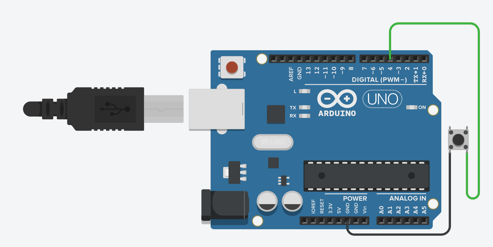

# CV1 – Input Pull-Up tlačítko → LED

## 🧩 Cíl
Naučit se používat **interní pull-up rezistor** na Arduinu a vysvětlit logiku tlačítka, které je aktivní v **LOW** stavu.

---

## 🔌 Zapojení

| Součástka | Popis |
|------------|--------|
| 1× Arduino UNO | řídicí deska |
| 1× Tlačítko | připojeno mezi pin **D2** a **GND** |
| 1× LED (vestavěná nebo externí) | vestavěná LED na **D13**, nebo externí LED přes rezistor do GND |
| 1× Rezistor (pokud LED externí) | 220 Ω |

**Schéma zapojení:**

---

## 🧠 Princip
- Pin je ve výchozím stavu **HIGH** díky internímu pull-up rezistoru.
- Po stisknutí tlačítka se pin připojí k **GND**, čímž čteme **LOW**.
- LED se rozsvítí, když je tlačítko stisknuté.

---

## 🎯 Zadání
1. Zapoj tlačítko dle schématu.  
2. Použij `pinMode(TLACITKO_PIN, INPUT_PULLUP);`.  
3. Když je tlačítko stisknuté, rozsvit LED.  
4. Přidej zpoždění 20 ms proti zákmitům.  
5. (Bonus) Vypisuj stav tlačítka do Serial monitoru.

---

## 💻 Program
Soubor: [`cv1-input-pull-up-tlacitko.ino`](./cv1-input-pull-up-tlacitko.ino)

---

## 🧪 Výsledek
- LED svítí pouze při stisku tlačítka.  
- V Serial monitoru se vypisuje „0“ / „1“.
