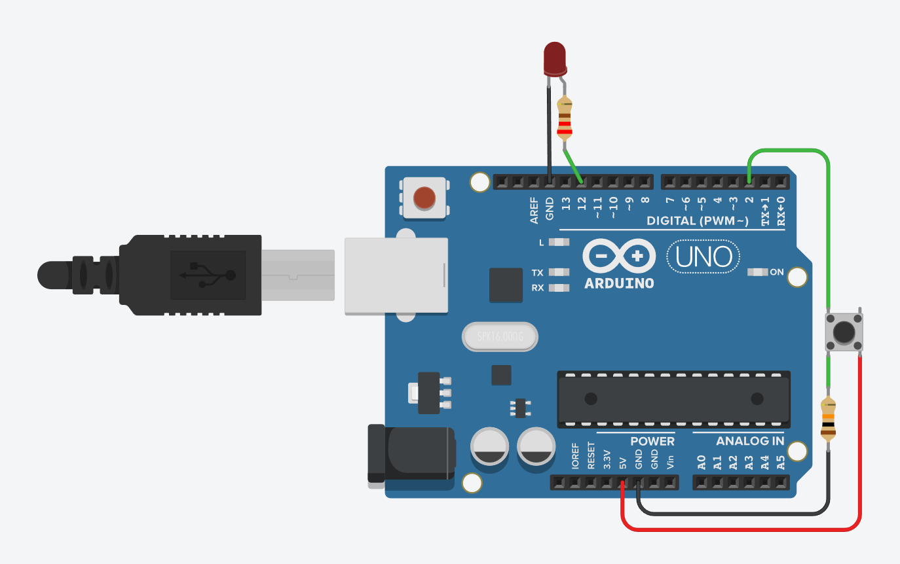

# CV2 – Externí rezistor (pull-down): tlačítko → LED

## 🧩 Cíl
Ukázat zapojení s **externím pull-down rezistorem** a logiku tlačítka, které je aktivní v **HIGH** stavu.

---

## 🔌 Zapojení

| Součástka | Popis |
|------------|--------|
| 1× Arduino UNO | řídicí deska |
| 1× Tlačítko | mezi pin **D2** a **+5V** |
| 1× Rezistor | 10 kΩ mezi **D2** a **GND** (pull-down) |
| 1× LED (vestavěná nebo externí) | vestavěná LED na **D13**, nebo externí LED přes rezistor do GND |
| 1× Rezistor (pro LED) | 220 Ω |

**Schéma zapojení:**

---

## 🧠 Princip
- Pin je ve výchozím stavu **LOW** (přes 10 kΩ do GND).  
- Po stisknutí tlačítka se pin připojí na **+5V**, čímž čteme **HIGH**.  
- LED svítí při stisku tlačítka.

---

## 🎯 Zadání
1. Zapoj tlačítko s **externím pull-down rezistorem**.  
2. Použij `pinMode(TLACITKO_PIN, INPUT);`.  
3. Pokud je pin **HIGH**, rozsvit LED, jinak ji zhasni.  
4. Přidej zpoždění 20 ms proti zákmitům.  
5. (Bonus) Přidej výpis stavu tlačítka do Serial monitoru.

---

## 💻 Program
Soubor: [`cv2-externi-rezistor-tlacitko.ino`](./cv2-externi-rezistor-tlacitko.ino)

---

## 🧪 Výsledek
- LED svítí při stisku tlačítka.  
- Pin je stabilní i bez interního rezistoru díky externímu 10 kΩ pull-downu.
