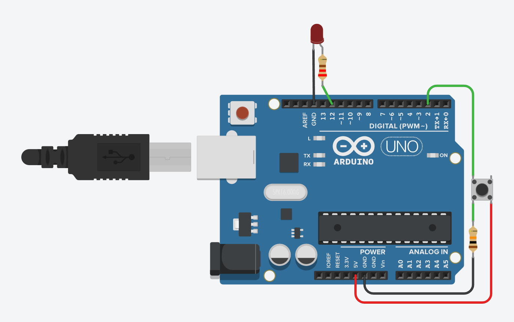

# CV3 – „Přepínač“: jedno tlačítko přepíná stav LED

## 🧩 Cíl
Ukázat, jak jedno tlačítko může **přepínat stav LED** (toggle funkce).  
Používá se **INPUT_PULLUP** a ošetření zákmitů pomocí `millis()`.

---

## 🔌 Zapojení

| Součástka | Popis |
|------------|--------|
| 1× Arduino UNO | řídicí deska |
| 1× Tlačítko | mezi **D2** a **GND** |
| 1× LED (vestavěná nebo externí) | vestavěná LED na **D13**, nebo externí LED přes rezistor 220–330 Ω do GND |

**Schéma zapojení:**

---

## 🧠 Princip
- Pin používá interní **pull-up rezistor** → výchozí stav HIGH.  
- Při stisku tlačítka pin čte **LOW**.  
- Každý stisk (přechod z HIGH → LOW) **přepne stav LED**.  
- Program rozpozná pouze změnu, ne držení tlačítka.

---

## 🎯 Zadání
1. Zapoj tlačítko dle schématu.  
2. Použij `pinMode(PIN_BTN, INPUT_PULLUP);`.  
3. Implementuj přepínání stavu LED při každém stisku.  
4. Ošetři zákmit pomocí časové podmínky (např. 50 ms).  
5. (Bonus) Přidej dlouhý stisk = vypnout LED.

---

## 💻 Program
Soubor: [`cv3-prepinac-tlacitko.ino`](./cv3-prepinac-tlacitko.ino)

---

## 🧪 Výsledek
- Každé stisknutí tlačítka přepne LED (ON ↔ OFF).  
- LED nereaguje na zákmit ani dlouhý stisk.
