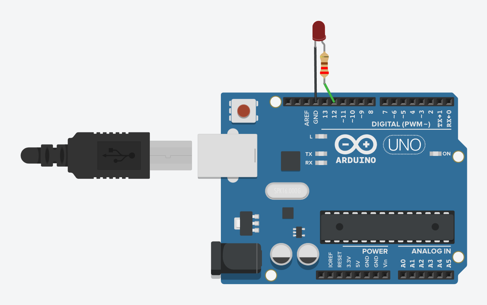

# Délka držení tlačítka

## 🧩 Cíl
Ukázat, jak lze pomocí Serial Monitoru nechat uživatele zadat číslo a podle něj rozblikávat LED diodu.
Program přijímá číslo z klávesnice, uloží ho do proměnné a následně LED tolikrát zabliká.

---

## 🔌 Zapojení

| Součástka             | Popis                                       |
| --------------------- | ------------------------------------------- |
| 1× Arduino UNO        | řídicí deska                                |
| 1× LED dioda          | připojena na **pin D12**                    |
| 1× Rezistor (pro LED) | 220 Ω mezi LED a GND                        |

**Schéma zapojení:**

---

## 🧠 Princip
- LED je připojena na digitální pin D12, přes rezistor do GND.
- Arduino čeká na vstup od uživatele v Serial Monitoru.
- Uživatel napíše číslo → program ho načte pomocí `Serial.parseInt()`.
- LED dioda blikne přesně tolikrát, kolik uživatel zadal.
- Po každém blikání program znovu vyzve uživatele k zadání další hodnoty.

---

## 🎯 Zadání
1. Zapojte LED na pin D12 přes rezistor (220 Ω) do GND.
2. Otevřete Serial Monitor (rychlost 9600).
3. Nechte Arduino uživatele vyzvat:
  → „Kolikrát má LED zablikat?“
4. Po zadání čísla LED:
  → blikne tolikrát, kolik uživatel zadal.
5. Po dokončení vypište zpětnou informaci s počtem bliknutí.
6. Program se pak vrací zpět na začátek a čeká na další vstup.

---

## 💻 Program
Soubor: [`blikani-led-podle-uzivatele.ino`](./blikani-led-podle-uzivatele.ino)

---

## 🧪 Výsledek
- Uživatel zadá číslo do Serial Monitoru.
- LED na pinu D12 blikne přesně tolikrát, kolik zadal.
- Program po každém blikání očekává další vstup.
  
---

## 📘 Poznámka
Tato úloha ukazuje práci se Serial Monitor a načítáním dat od uživatele.
Zároveň žáky seznamuje se strukturou programu, jednoduchou komunikací a prací se smyčkou `for`.

