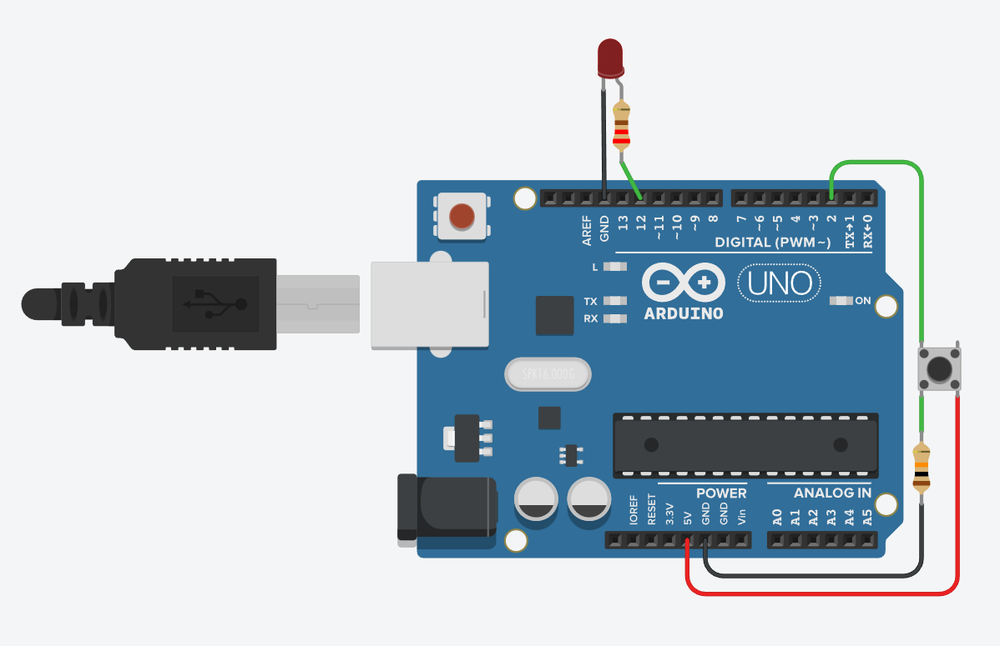

# Délka držení tlačítka

## 🧩 Cíl
Ukázat, jak pomocí funkce `millis()` změřit dobu, po kterou je tlačítko drženo, a během stisku rozsvítit LED diodu.
V zapojení se používá externí pull-down rezistor (10 kΩ), který drží vstupní pin v logické 0, dokud není tlačítko stisknuté.

---

## 🔌 Zapojení

| Součástka | Popis |
|------------|--------|
| 1× Arduino UNO | řídicí deska |
| 1× Tlačítko | jeden kontakt na **pin D2**, druhý na **+5 V** |
| 1× Rezistor | **10 kΩ** mezi pinem **D2** a **GND** (pull-down) |
| 1× LED dioda | připojena na **pin D12** přes rezistor 220 Ω do GND |
| 1× Rezistor (pro LED) | 220 Ω |

**Schéma zapojení:**

---

## 🧠 Princip
- Pin D2 je nastaven jako vstup (INPUT) bez interních rezistorů.
- Externí pull-down rezistor (10 kΩ) drží pin v logické hodnotě LOW.
- Po stisku tlačítka se pin propojí na +5 V → čteme HIGH.
- Program pomocí dvou stavů rozpozná:
    -> stisk (LOW → HIGH) → uloží čas začátku (millis()), rozsvítí LED,
    -> puštění (HIGH → LOW) → spočítá délku stisku a LED zhasne.
- Doba držení tlačítka se vypíše v milisekundách do Serial Monitoru.

---

## 🎯 Zadání
1. Zapojte tlačítko s externím pull-down rezistorem (10 kΩ mezi D2 a GND).
2. LED připojte na pin D12 přes rezistor 220 Ω do GND.
3. V programu:
   
    -> načítejte stav tlačítka pomocí digitalRead(),
    -> detekujte přechody:
    -> LOW → HIGH = začátek držení,
    -> HIGH → LOW = konec držení,
    -> ukládejte čas pomocí millis().
5. Po puštění tlačítka vypište do Serial Monitoru dobu, po kterou bylo stlačeno.

---

## 💻 Program
Soubor: [`delka-drzeni-tlacitka.ino`](./delka-drzeni-tlacitka.ino)

---

## 🧪 Výsledek
- LED dioda svítí pouze při držení tlačítka.
- Po puštění se do Serial Monitoru vypíše:

  -> Drzel jsi tlacitko XXX ms
- Program správně detekuje stisk i puštění (hrany), ne jen aktuální stav.
  
---

## 📘 Poznámka
Toto cvičení ukazuje praktické použití funkce `millis()`, která umožňuje měřit čas bez blokování programu.
Stejný princip se používá např. pro dlouhé stisky, časovače, hry, debouncing tlačítek nebo jednoduché stopky.

