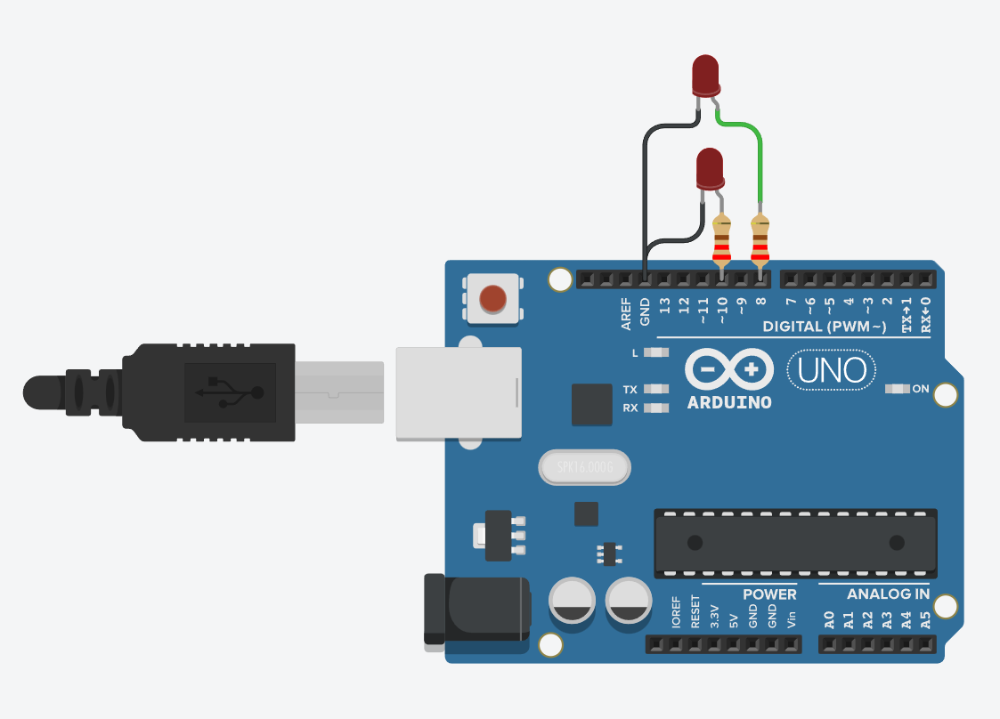

# Millis a 2 LED s intervaly

## 🧩 Cíl
Ukázat, jak pomocí funkce `millis()` nezávisle ovládat dvě LED, z nichž každá bliká s jiným časovým intervalem.
Program neobsahuje žádné `delay()`, takže Arduino může vykonávat více úloh současně.

---

## 🔌 Zapojení

| Součástka           | Popis                                     |
| ------------------- | ----------------------------------------- |
| 1× Arduino UNO      | řídicí deska                              |
| 2× LED dioda        | první LED na **D10**, druhá LED na **D8** |
| 2× Rezistor pro LED | 220 Ω mezi LED a GND                      |

**Schéma zapojení:**

---

## 🧠 Princip
- Základem je funkce `millis()`, která vrací čas od spuštění programu.
- Pro každou LED si uložíme:
  
    → čas posledního bliknutí (predchoziCas1, predchoziCas2),
  
    → interval, po kterém má LED změnit stav (INTERVAL1, INTERVAL2).

- Program nečeká pomocí `delay()`, ale pouze kontroluje:

    → „Uplnul interval od poslední změny?“

    → Ano → přepne stav LED

    → Ne → pokračuje dál

- Díky tomu mohou obě LED blikat nezávisle a Arduino se nezastaví jako u `delay()`.

---

## 🎯 Zadání
1. Zapojte dvě LED diody na piny D10 a D8, každou přes rezistor 220 Ω.
2. V programu nastavte oba piny jako `OUTPUT`.
3. Pro každou LED vytvořte:

    → proměnnou pro uložení posledního času bliknutí,

    → vlastní interval v milisekundách.

4. Nachystejte podmínku ve stylu: `if (millis() - predchoziCas >= INTERVAL) { ... }`
5. Stav LED přepínejte invertováním pomocí: `digitalWrite(pin, !digitalRead(pin));`

---

## 💻 Program
Soubor: [`millis-led-a-intervaly.ino`](./millis-led-a-intervaly.ino)

---

## 🧪 Výsledek
- LED na pinu 10 bliká každých 500 ms.
- LED na pinu 8 bliká každých 1000 ms.
- Obě LED jsou řízeny nezávisle pomocí `millis()`.
- Program neblokuje běh, takže je připraven na další úkoly (tlačítka, čidla, atd.).
  
---

## 📘 Poznámka
- Tento příklad je jeden z nejdůležitějších při výuce Arduina.
- Ovládání více úloh pomocí `millis()` je základ pro:

    → semafory
    → časovače
    → animace LED
    → čtení senzorů bez zpoždění
    → multitasking bez použití `delay()`
