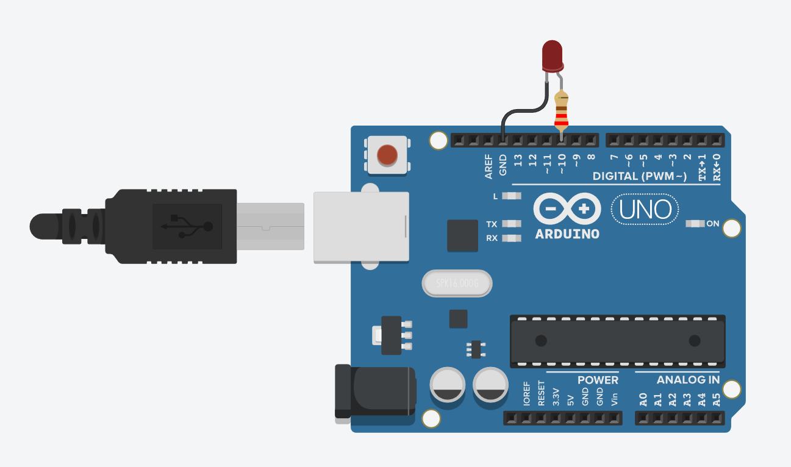

# Millis a LED

## 🧩 Cíl
Ukázat, jak pomocí funkce `millis()` periodicky blikat LED diodou, aniž by program používal delay().
Díky tomu může Arduino zároveň provádět více úkolů a není „zmrzlé“ čekáním.

---

## 🔌 Zapojení

| Součástka             | Popis                                     |
| --------------------- | ----------------------------------------- |
| 1× Arduino UNO        | řídicí deska                              |
| 1× LED dioda          | připojena na **pin D10**                  |
| 1× Rezistor (pro LED) | 220 Ω mezi LED a GND                      |

**Schéma zapojení:**

---

## 🧠 Princip
- Funkce `millis()` vrací čas od spuštění programu v milisekundách.
- Program si uloží čas posledního bliknutí do proměnné predchoziCas.
- Pokaždé porovnává:
  
    → „Uběhl už INTERVAL od poslední změny stavu?“

- Pokud ano:

    → aktualizuje predchoziCas,

    → přepne stav LED (zapne / vypne).

- Nepoužívá se  `delay()`, takže Arduino stále běží a je připraveno dělat další úlohy.

---

## 🎯 Zadání
1. Zapojte LED na pin D10 přes rezistor (220 Ω).
2. Nastavte pin jako `OUTPUT`.
3. Vytvořte proměnnou pro uložení času posledního bliknutí.
4. Pomocí konstrukce: `if (millis() - predchoziCas >= INTERVAL) { ... }` kontrolujte uplynutí intervalu.
5. Stav LED přepínejte invertováním:  `digitalWrite(LED_PIN, !digitalRead(LED_PIN));`

---

## 💻 Program
Soubor: [`millis-led.ino`](./millis-led.ino)

---

## 🧪 Výsledek
- LED na pinu D10 bliká každou 1 sekundu.
- Arduino nezamrzá jako při použití `delay()`.
- Můžete snadno přidat další funkce do programu (tlačítka, senzory, více LED).
  
---

## 📘 Poznámka
Tento příklad je základ pro pokročilejší projekty využívající časovače, multitasking, animace LED, semafory, měření času, nebo debouncing.
Práce s `millis()` je jeden z nejdůležitějších principů při programování Arduina.
