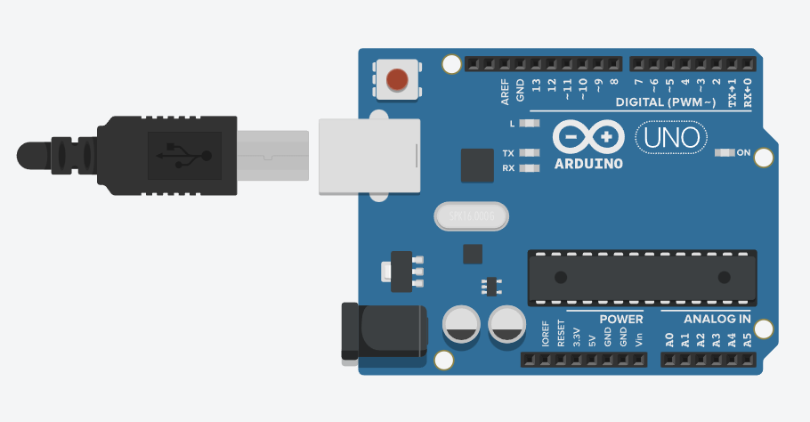

# Představení millis

## 🧩 Cíl
Ukázat, jak funkce `millis()` vrací čas od spuštění programu v milisekundách.
Úloha slouží jako základní seznámení s časováním na Arduinu.

---

## 🔌 Zapojení

| Součástka      | Popis                 |
| -------------- | --------------------- |
| 1× Arduino UNO | řídicí deska          |

**Schéma zapojení:**

---

## 🧠 Princip
- Funkce millis() vrací počet milisekund, které uběhly od startu programu.
- Hodnota neustále roste: 0 → 1000 → 2000 → 3000…
- Slouží pro časování bez `delay()`.
- V této jednoduché úloze se čas pouze vypisuje do Serial Monitoru.

---

## 🎯 Zadání
1. Připojte Arduino k počítači.
2. Nahrajte kód a otevřete Serial Monitor.
3. Sledujte, jak se číslo zvyšuje každou sekundu.

---

## 💻 Program
Soubor: [`predstaveni-millis.ino`](./predstaveni-millis.ino)

---

## 🧪 Výsledek
- V Serial Monitoru vidíte běžící čas: 0, 1000, 2000, 3000, 4000 …
- Každá hodnota znamená čas v milisekundách, který uplynul od startu programu.
  
---

## 📘 Poznámka
Tato úloha slouží jako úvod do práce s časem.
V dalších cvičeních se `millis()` využije pro neblokující blikání LED a později i časovače a senzory.
